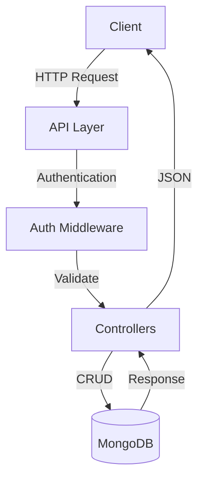

# PhotoFlow Backend API Documentation

A social media platform backend API built with Node.js, Express, and MongoDB.

## Data Flow Architecture



## File Structure

```
backend/
├── controllers/
│   ├── authController.js    # Authentication logic
│   ├── errorController.js   # Error handling
│   ├── postController.js    # Post operations
│   └── userController.js    # User operations
├── models/
│   ├── userModel.js        # User schema
│   ├── postModel.js        # Post schema
│   └── commentModel.js     # Comment schema
├── routes/
│   ├── userRoutes.js      # User routes
│   └── postRoutes.js      # Post routes
└── middleware/
    ├── isAuthenticated.js  # Auth middleware
    └── multer.js          # File upload
```

## API Endpoints

### Authentication Routes

#### Sign Up

- **URL**: `/api/v1/users/signup`
- **Method**: `POST`
- **Body**:

```json
{
  "username": "string",
  "email": "string",
  "password": "string",
  "passwordConfirm": "string"
}
```

- **Response**: `200 OK`
  - Returns user data and JWT token

#### Verify Account

- **URL**: `/api/v1/users/verify`
- **Method**: `POST`
- **Auth**: Required
- **Body**:

```json
{
  "otp": "string"
}
```

- **Response**: `200 OK`

#### Login

- **URL**: `/api/v1/users/login`
- **Method**: `POST`
- **Body**:

```json
{
  "email": "string",
  "password": "string"
}
```

- **Response**: `200 OK`
  - Returns user data and JWT token

#### Logout

- **URL**: `/api/v1/users/logout`
- **Method**: `POST`
- **Response**: `200 OK`

### User Routes

#### Get Profile

- **URL**: `/api/v1/users/profile/:id`
- **Method**: `GET`
- **Response**: `200 OK`
  - Returns user profile data

#### Edit Profile

- **URL**: `/api/v1/users/edit-profile`
- **Method**: `POST`
- **Auth**: Required
- **Body**: `multipart/form-data`
  - `bio`: string
  - `profilePicture`: file
- **Response**: `200 OK`

#### Follow/Unfollow User

- **URL**: `/api/v1/users/follow-unfollow/:id`
- **Method**: `POST`
- **Auth**: Required
- **Response**: `200 OK`

### Post Routes

#### Create Post

- **URL**: `/api/v1/posts/create-post`
- **Method**: `POST`
- **Auth**: Required
- **Body**: `multipart/form-data`
  - `caption`: string
  - `image`: file
- **Response**: `200 OK`

#### Get All Posts

- **URL**: `/api/v1/posts/all`
- **Method**: `GET`
- **Response**: `200 OK`
  - Returns array of posts

#### Like/Dislike Post

- **URL**: `/api/v1/posts/like-dislike/:id`
- **Method**: `POST`
- **Auth**: Required
- **Response**: `200 OK`

#### Add Comment

- **URL**: `/api/v1/posts/comment/:id`
- **Method**: `POST`
- **Auth**: Required
- **Body**:

```json
{
  "text": "string"
}
```

- **Response**: `201 Created`

## Error Responses

All endpoints may return the following error responses:

- `400 Bad Request`: Invalid input data
- `401 Unauthorized`: Missing or invalid authentication
- `403 Forbidden`: Insufficient permissions
- `404 Not Found`: Resource not found
- `500 Server Error`: Internal server error

## Authentication

The API uses JWT (JSON Web Tokens) for authentication. Include the token in:

- Cookie: `token`
- or Authorization header: `Bearer <token>`

## File Upload

Image uploads are handled using Multer and stored in Cloudinary. Supported formats:

- JPEG/JPG
- PNG
- GIF

## Rate Limiting

API requests are limited to protect the server from abuse:

- 100 requests per IP per 15 minutes
- Applies to all endpoints

## Environment Variables

Required environment variables:

```
PORT=3000
DB=mongodb://connection-string
JWT_SECRET=your-secret-key
JWT_EXPIRES_IN=90d
JWT_COOKIE_EXPIRES_IN=90
CLOUDINARY_CLOUD_NAME=your-cloud-name
CLOUDINARY_API_KEY=your-api-key
CLOUDINARY_API_SECRET=your-api-secret
```
