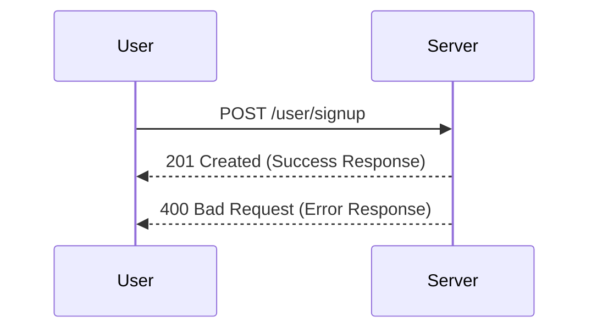
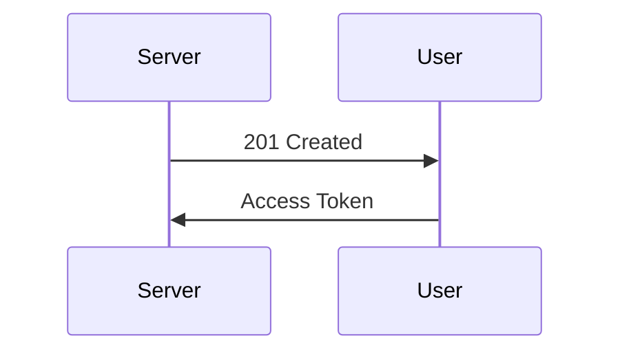
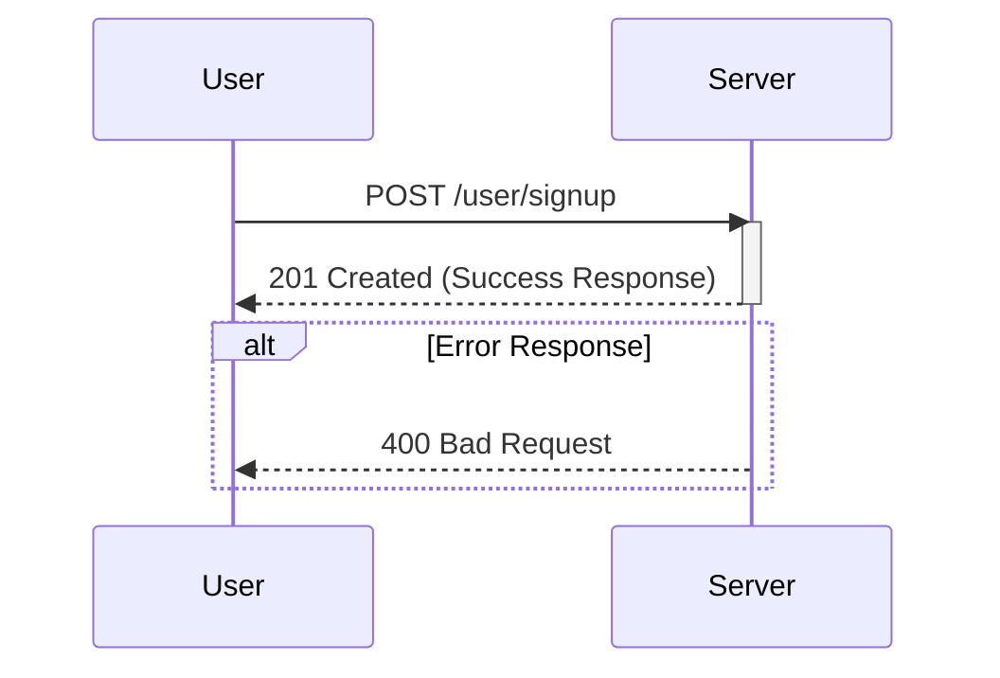

# PhotoFlow API Documentation

## Authentication Endpoints

### Signup

`POST /user/signup`

Register a new user in the system.

#### Request Body

```json
{
  "username": "string",
  "email": "string",
  "password": "string",
  "passwordConfirm": "string"
}
```

#### Response

**Success Response (201 Created)**

```json
{
  "status": "success",
  "token": "jwt_token_here",
  "data": {
    "user": {
      "username": "string",
      "email": "string",
      "id": "string"
    }
  }
}
```

**Error Response (400 Bad Request)**

```json
{
  "status": "fail",
  "message": "Error message here"
}
```

#### Required Fields

| Field           | Type   | Description                     |
| --------------- | ------ | ------------------------------- |
| username        | string | User's full name                |
| email           | string | Valid email address             |
| password        | string | Password (minimum 8 characters) |
| passwordConfirm | string | Must match password field       |

#### Diagrams

**Request Flow**



**Response Flow**



**Detailed Request-Response Flow**


